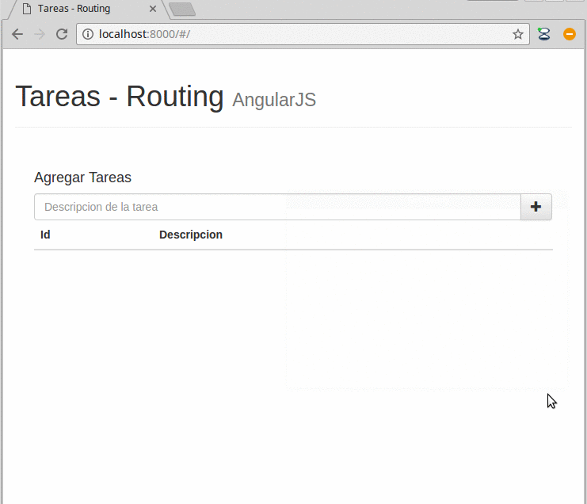

# (Taller de Routing) Lista de Tareas pendientes en Angular

</img>

Es una lista de tareas donde para editarla debés cambiar la vista de tu aplicación utilizando el módulo de routing.

Hay dos versiones:

* fresh/: una versión inicial para hacer el taller
* trunk/: la version completa
